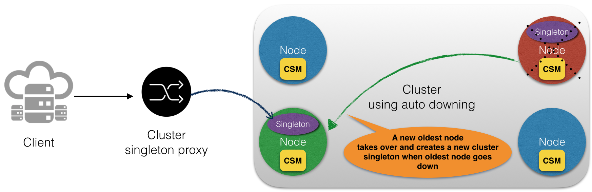
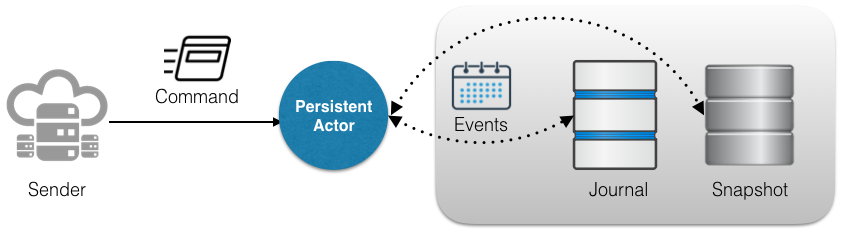

Objective
===================

This project demonstrates a working example of cluster singleton i.e. it ensures exactly one actor of a certain type is running somewhere in the cluster. 

## Background

The cluster configuration uses auto-downing; meaning unreachable nodes will be marked as down by the leader of the cluster.

### Cluster Singleton Manager

Actor that ensures only one instance of singleton actor is running 
* for all nodes of the cluster (in case of a global singleton) or
* for a group of nodes tagged with a specific role (in case of singleton actor per specific role of a node).
 
In order to accomplish this, the cluster singleton manager actor runs either on 
* all nodes of the cluster or 
* a group of nodes tagged with a specific role
depending on the requirements of the singleton i.e. global singleton or singleton for a specific role. 

### Failure recovery of cluster singleton 
 
On the oldest node of the cluster, cluster singleton manager creates the singleton actor, as a child actor from supplied props. If the oldest nodes becomes unreachable, the cluster failure detector will notice it to turn it down. A new oldest node takes over and a new singleton actor is created on that node. 
        
### Cluster singleton proxy

Cluster singleton proxy will route all messages it receives to current instance of the singleton, by keeping track of the oldest node in the cluster that's up and running. 

If the oldest node in the cluster holding the singleton actor becomes unreachable, it'll stash messages to the singleton actor until next oldest node in the cluster takes over.
 
## Persistent Actor

An actor that persists mutations to its internal state with a journal (instead of saving the internal state directly) so that its internal state can be reconstructed by re-applying stored events, when required.

A persistent actor handles two types of messages namely **_command_** and **_events_**. 
* **_Commands_** represent operations from outside world
* **_Events_** represent applied operations that are stored in a journal. 

### Functioning of a persistent actor

1. Incoming commands are validated. They're checked if they can be applied to the current internal state of the actor.
2. If preconditions are met and validation of a command succeeds, events are generated from the command. Generated events represent the effect of applying the command.
3. After the events are successfully persisted, they are used to mutate the actor's internal state.
4. Persisted events are replayed to restore the state of an actor, as it's known they can be successfully applied. Typically, it's done when a persistent actor is started or restarted.    

